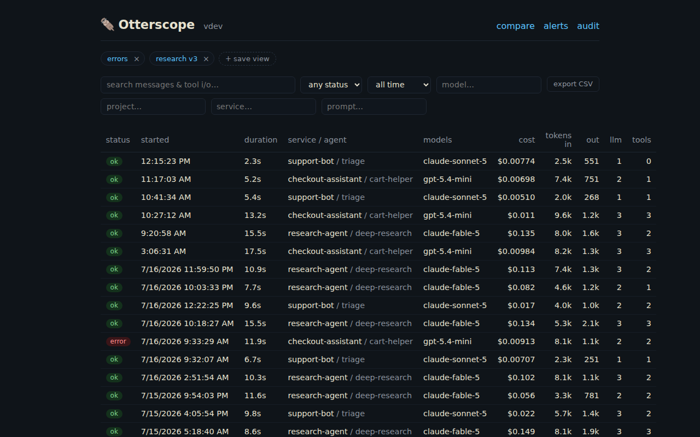
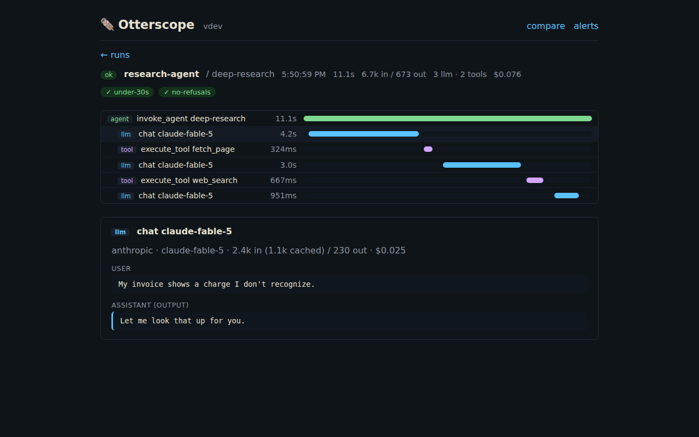
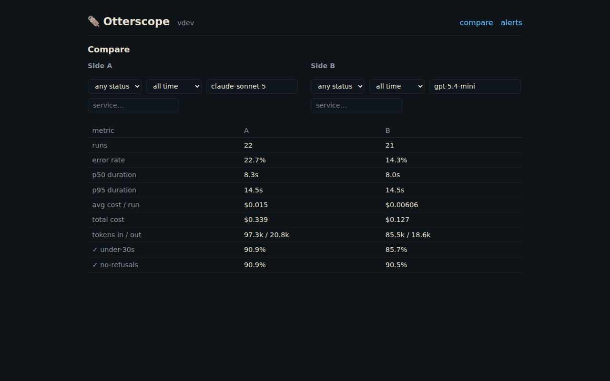

# Otterscope

**Lightweight, self-hosted observability and evals for AI agents.**

One static binary. One SQLite file. No ClickHouse, no Redis, no S3, no seat fees, no trace metering. Point your agent's OpenTelemetry exporter at Otterscope and get an agent-run-first view of everything it did — LLM calls, tool calls, loops, errors, latency, and cost — plus assertions and LLM-as-judge evals scored onto your real production runs. All on your own disk, with unlimited retention.

> Think *Plausible Analytics, but for AI agents*.



## Quick start

```sh
# grab a binary from Releases, then:
./otterscope serve
```

By default the UI and ingest bind to **loopback** (`127.0.0.1`) — safe on a
shared machine. To expose them on your network, pass `-listen :8317 -otlp :4318`.

or with Docker (the container binds all interfaces inside its namespace; you
control exposure with `-p`):

```sh
docker run -p 8317:8317 -p 4318:4318 -v otterscope:/data ghcr.io/otterscope/otterscope
```

Point any OTel-instrumented agent at it:

```sh
export OTEL_EXPORTER_OTLP_ENDPOINT=http://localhost:4318
```

Open **http://localhost:8317**. No account, no config file, no other services.

Want to poke around before wiring an agent? `./otterscope sample` seeds realistic demo runs.

## What you get

- **Runs, not span soup** — every trace becomes an agent run: steps, tool loops, per-run tokens and cost, error surfacing, live-tailing list with filters (status, model, service, project, time — all URL-shareable).
- **Run inspector** — step timeline with proportional duration bars; click any LLM call to read the actual messages in/out, token breakdowns (cache reads, reasoning), and cost; tool calls show arguments and results.

  
- **Cost tracking** — maintained pricing table for major providers (override or extend with `serve -pricing yours.json`); unknown models show tokens, never fabricated costs.
- **Evals fused into the trace store** — assertions (`contains`, `regex`, `is_json`, latency/cost thresholds) and **LLM-as-judge** scored onto real runs at ingest or backfilled on demand. The judge endpoint and key are server config (`-judge-url`, `OTTERSCOPE_JUDGE_KEY`), never per-assertion — so assertions can't name secrets to read. No second product.
- **Compare view** — error rate, p50/p95 latency, cost, and assertion pass rates side-by-side across any two filters: this week vs last, model A vs model B. *"Did my prompt change make things worse?"* is one URL.
- **Alerting** — rules on error rate, cost, p95 latency, or an assertion's fail rate over a window; Otterscope POSTs a JSON notification to your webhook (Slack/Discord/…) when a rule starts firing and again when it resolves.

  
- **Drop-in OTel compatibility** — normalizes the OTel GenAI conventions (both current dialects), OpenInference (OpenAI Agents SDK, CrewAI, LangChain), and the Vercel AI SDK. Raw payloads are retained, so old data benefits from future normalizer improvements.
- **Ask your agent about itself** — a built-in [MCP server](docs/mcp.md) (`POST /mcp`) lets Claude Code and other MCP clients query your runs, steps, cost, and stats. `claude mcp add otterscope --transport http http://localhost:8317/mcp`.
- **Projects + ingest keys** for isolating multiple agents; optional retention sweep (`-retention 720h`) if you *want* to delete data.

## Connecting your framework

Guides for [Pydantic AI](docs/frameworks/pydantic-ai.md), [OpenAI Agents SDK](docs/frameworks/openai-agents.md), [Vercel AI SDK](docs/frameworks/vercel-ai-sdk.md), [LangGraph](docs/frameworks/langgraph.md), and [anything else that speaks OTLP](docs/frameworks/generic-otlp.md).

## Why not Langfuse / LangSmith / Phoenix?

They're good products aimed at a different deployment reality:

- **Langfuse** self-hosting requires Postgres + ClickHouse + Redis + S3 — six containers to log a few thousand LLM calls a day.
- **LangSmith** and **Braintrust** gate self-hosting behind enterprise contracts.
- **Phoenix** is ELv2-licensed with an upsell funnel.

Otterscope is Apache-2.0, installs in one command, and is built for individuals and small teams whose traces contain customer data they'd rather keep on their own disk.

## Install

- **Binaries** — [Releases](https://github.com/otterscope/otterscope/releases) (Linux amd64/arm64, macOS, Windows) + `.deb`/`.rpm`
- **Homebrew** — `brew install otterscope/tap/otterscope`
- **Docker** — `ghcr.io/otterscope/otterscope`
- **Go** — `go install github.com/otterscope/otterscope/cmd/otterscope@latest`

## Development

Go backend, embedded React UI. `go build ./...` works without building the frontend; `cd web && npm run build` embeds the real UI. See [CLAUDE.md](CLAUDE.md) for architecture and [docs/WORKFLOW.md](docs/WORKFLOW.md) for the contribution process.

## License

[Apache-2.0](LICENSE)
